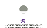

  

---

> "Run as fast as your compilator"

---

# 👾 Mr Akoton
I’m a programming enthusiast still exploring the vast world of code one line at a time. I’m driven by a deep desire to learn, experiment, and most of all — **create**.

---

# Languages and Tools

